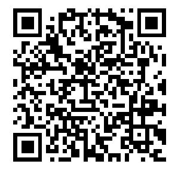

# cryptocurrencies-a-poor-replacement-for-paper

Material for an article about the cryptocurrencies and the blockchain.

- histo-ether - https://etherscan.io/chart/tx
- histo-bitcoin - https://data.nasdaq.com/data/BCHAIN/NTRAN-bitcoin-number-of-transactions
- histo-visa:
  - https://s1.q4cdn.com/050606653/files/doc_financials/annual/Visa-2016-Annual-Report.pdf
  - https://s1.q4cdn.com/050606653/files/doc_financials/annual/2018/Visa-2018-Annual-Report-FINAL.pdf
  - https://s29.q4cdn.com/385744025/files/doc_downloads/Visa-Inc_-Fiscal-2021-Annual-Report.pdf
  - https://s29.q4cdn.com/385744025/files/doc_downloads/2022/Visa-Inc-Fiscal-2022-Annual-Report.pdf
- histo-mastercard:
  - https://www.ezodproxy.com/mastercard/2017/ar/images/Mastercard-AR2016.pdf
  - https://www.ezodproxy.com/mastercard/2018/ar/images/Mastercard-AR2017.pdf
  - https://www.ezodproxy.com/mastercard/2019/ar/HTML1/mastercard-10k2018_0004.htm
  - https://s25.q4cdn.com/479285134/files/doc_financials/2019/ar/2019-Annual-Report-on-Form-10-K.pdf
  - https://s25.q4cdn.com/479285134/files/doc_financials/2020/ar/MA.12.31.2020-10-K-as-filed-w-exhibits.pdf
  - https://s25.q4cdn.com/479285134/files/doc_financials/2021/ar/2021-Annual-Report-NO-EMAIL-ALERTS.pdf

## Support

If you really liked my research, from the conclusion of the article I can not, not give you a bitcoin address :)

bc1q2yupmjw9vz0r9dqxw2wedsxwefd06avtwptztu

Thank you for all of your support, most especially if you read everything.

In fact, better than a donation, spread the article the most as possible and you would be really appreciated :pray: